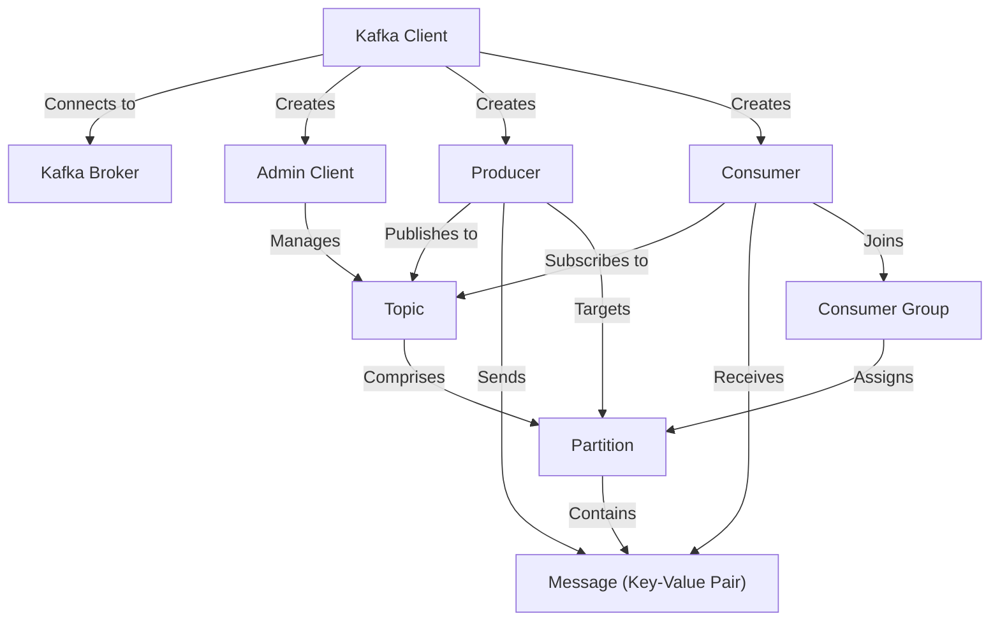
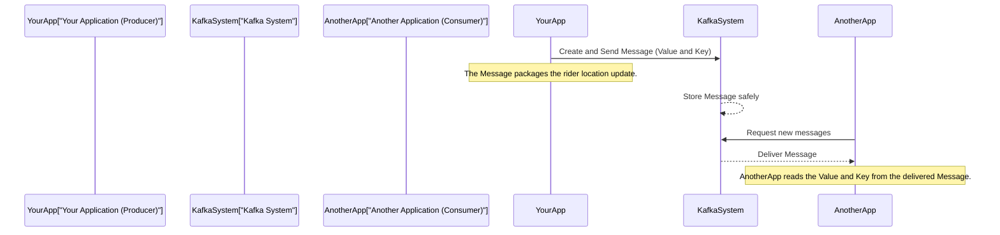
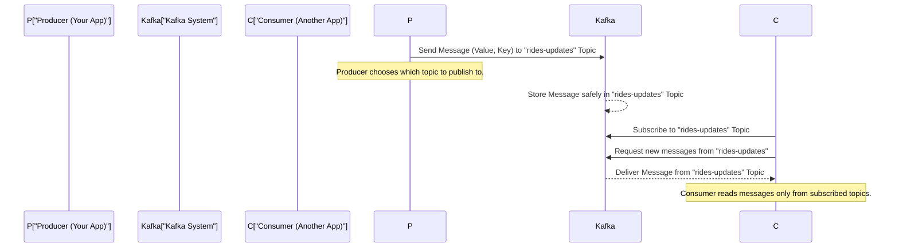
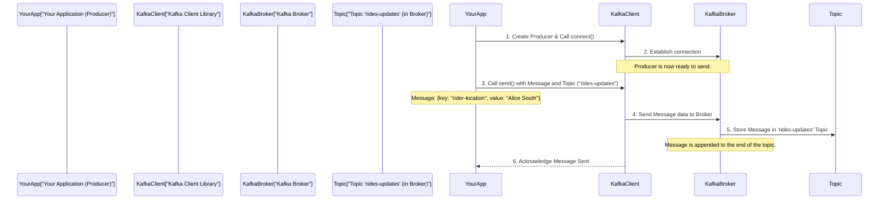
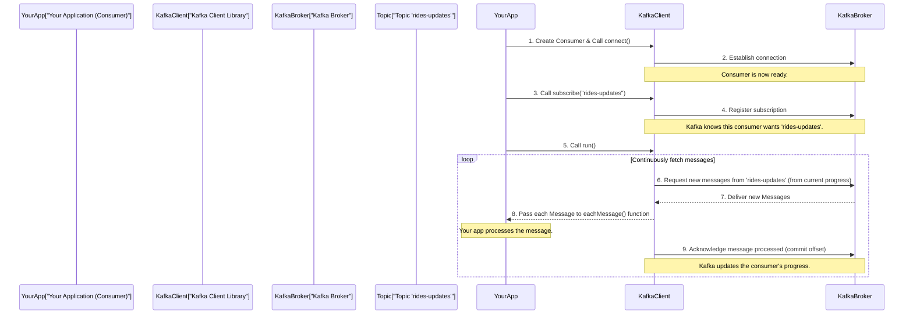
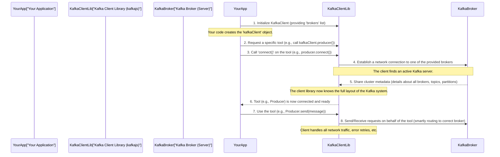
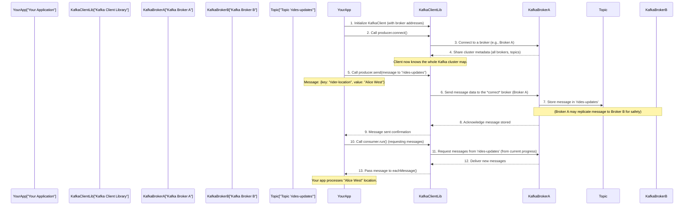
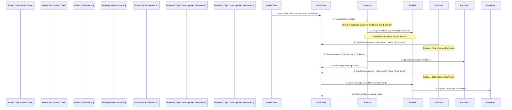
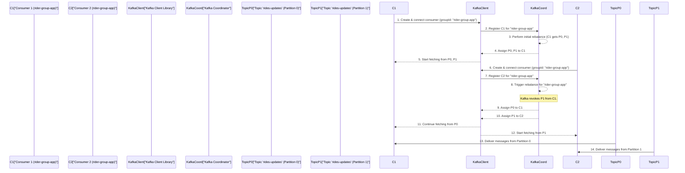
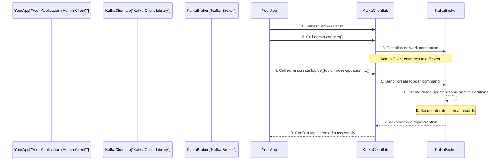

# Tutorial: kafka

This project demonstrates how to interact with a Kafka cluster using Node.js. It illustrates the fundamental concepts of Kafka, showing how *applications can send and receive real-time data* using **Producers** and **Consumers**. The project also covers how an **Admin Client** can manage the Kafka cluster, specifically by creating **Topics** to organize data, which are then stored across **Kafka Brokers** in smaller segments called **Partitions**.


## Visual Overview



## Chapters

1. [Message (Key-Value Pair)
](01_message__key_value_pair__.md)
2. [Topic
](02_topic_.md)
3. [Producer
](03_producer_.md)
4. [Consumer
](04_consumer_.md)
5. [Kafka Client
](05_kafka_client_.md)
6. [Kafka Broker
](06_kafka_broker_.md)
7. [Partition
](07_partition_.md)
8. [Consumer Group
](08_consumer_group_.md)
9. [Admin Client
](09_admin_client_.md)

---


# Chapter 1: Message (Key-Value Pair)

Welcome to the exciting world of Kafka! If you're new here, don't worry, we'll start with the very basics, explaining things step-by-step. Our first stop is understanding the fundamental unit of data in Kafka: the **Message**.

### What's the Big Deal with a Message?

Imagine you're running a busy ride-sharing app. Hundreds of riders are constantly moving, and their locations are always changing. Other parts of your app – like the driver dispatch system, the billing system, or the customer support dashboard – all need to know about these updates as they happen. How do you efficiently package and share this tiny piece of information, like "Rider John Doe just moved to Park Avenue"?

This is exactly the problem a **Message** solves in Kafka. It's like a small, self-contained data package that your applications can send and receive.

### The Anatomy of a Kafka Message

Every message in Kafka primarily consists of two parts: a **Value** and an optional **Key**. Think of it like a letter in an envelope:

*   **Value (The Letter's Content):** This is the most important part. It holds the actual data or information you want to send. In our ride-sharing example, the value would be the rider's name and their new location. It could be a simple text, a number, or a more structured format like JSON (which is very common).

*   **Key (The Label on the Envelope):** This part is optional but very useful. The key is typically used as a label or an identifier for the message. For instance, in our ride-sharing app, the key could be the "Rider ID" or "rider-location" if we want to group all updates related to a specific rider, or all updates about locations. Keys help Kafka organize messages efficiently, especially when you have many different types of data flowing.

Let's look at an example for our rider location update:

*   **Value:** `{"name": "John Doe", "location": "Park Avenue"}` (This is the actual data about John's new position.)
*   **Key:** `"rider-id-123"` (This helps identify that this message is about rider 123.)

### Messages in Action: Sending and Receiving Data

When your application wants to send information (like a rider update), it creates a Message with a `value` and, optionally, a `key`. An application that sends messages is called a [Producer](03_producer_.md).

Let's look at a simplified code snippet showing how a message is created and sent in JavaScript using the `kafkajs` library:

```javascript
// ... part of producer.js
await producer.send({
  topic: "rides-updates", // This is where the message will go (more on this later!)
  messages: [
    {
      // The actual data content
      value: JSON.stringify({
        name: "jhon doe",
        location: "40.7128° N, 74.0060° W",
      }),
      // An optional key for organization
      key: "rider-location",
      // We'll discuss 'partition' later, don't worry for now!
      partition: 0,
    },
  ],
});
// ...
```
In this code, we're creating a message where the `value` is a JSON string describing "jhon doe"'s location. We've also given it a `key` called "rider-location." This message is ready to be sent to a specific "rides-updates" [Topic](02_topic_.md) (which we'll cover in the next chapter!).

Once a message is sent, other applications interested in these updates (called [Consumer](04_consumer_.md)s) can receive it. When a [Consumer](04_consumer_.md) gets a message, it can easily access its `value` and `key`.

Here's how a [Consumer](04_consumer_.md) might process a received message:

```javascript
// ... part of consumer.js
await consumer.run({
    eachMessage: async ({ topic, partition, message }) => {
        // 'message' object contains the value and key
        console.log(`Received update: ${message.value.toString()}`);
        // If the message had a key, we could access it like:
        // console.log(`Key: ${message.key.toString()}`);
    },
});
// ...
```
As you can see, the [Consumer](04_consumer_.md) directly accesses `message.value` to get the actual data, converting it to a string for display. If a `key` were present, it could also be accessed similarly.

### How Messages Flow Internally

When your application sends a message, it doesn't just instantly appear everywhere. There's a process involved:



1.  **Your Application (The [Producer](03_producer_.md))** decides it has new information (like "John Doe moved to a new street!").
2.  It then packages this information into a **Message**, assigning the actual location data to the `value` and an optional identifier (like "rider-location" or "rider-id-123") to the `key`.
3.  This message is then sent to the **Kafka System**.
4.  The **Kafka System** receives this message and stores it reliably.
5.  Later, **Another Application (The [Consumer](04_consumer_.md))** that is interested in rider updates asks the **Kafka System** for any new messages.
6.  The **Kafka System** delivers the stored message to the **Consumer**.
7.  The **Consumer** then extracts the `value` and `key` from the message to process the rider's new location.

### A Deeper Look at Message Creation

Let's peek at a slightly more involved example from our project, showing how a user's input can be turned into a Kafka message:

```javascript
// ... part of producer-cli.js
rl.on("line", async function (line) {
    const [riderName, location] = line.split(" "); // Example input: "John North"
    await producer.send({
      topic: "rides-updates",
      messages: [
        {
          key: "rider-location", // The key for this message
          value: JSON.stringify({ name: riderName, location }), // The value
          partition: location.toLowerCase() === "north" ? 0 : 1, // Will be explained later!
        },
      ],
    });
});
// ...
```
In this snippet, `producer-cli.js` is set up to read commands from your terminal. If you type "John North", the code takes "John" as `riderName` and "North" as `location`. It then creates a message:

*   The `key` is fixed as `"rider-location"`.
*   The `value` is created by taking `riderName` and `location` and putting them into a JSON string: `{"name": "John", "location": "North"}`.

This demonstrates how flexible and powerful messages are for wrapping up different pieces of information into a single, transferable unit.

### Conclusion

You've just learned about the core building block of Kafka: the **Message**! You now know that it's a small data package, primarily consisting of a `value` (the actual data) and an optional `key` (for identification or organization). You've seen how [Producer](03_producer_.md)s create these messages and how [Consumer](04_consumer_.md)s read them.

Messages are crucial because they allow different parts of your application to communicate asynchronously and reliably. But where do these messages go after they are sent? How does Kafka know which messages belong together? That's what we'll explore in the next chapter: [Topic](02_topic_.md)!

---


# Chapter 2: Topic

Welcome back to our Kafka adventure! In [Chapter 1: Message (Key-Value Pair)](01_message__key_value_pair__.md), we learned that the fundamental unit of data in Kafka is the **Message** – a small package holding a `value` (the actual data) and an optional `key` (for identification). Messages are like tiny, important notes you want to share.

But what if you have hundreds, thousands, or even millions of these notes? How do you keep track of which notes are about what? Imagine trying to find a specific ride update for "John Doe" if all messages – from ride updates to billing info to customer support requests – were just thrown into one giant pile. It would be a messy, impossible task!

This is where the concept of a **Topic** comes in.

### What is a Topic?

A **Topic** is like a named category, a dedicated channel, or, to use a common analogy, a **bulletin board** for messages. Each bulletin board is for a specific subject, and all messages posted there are related to that subject.

Think of our ride-sharing app:

*   You might have a bulletin board named `rides-updates` where all messages about riders moving or rides starting/ending are posted.
*   You could have another bulletin board named `payments-info` for messages about transaction details.
*   And perhaps `driver-locations` for updates on where drivers are.

By organizing messages into topics, Kafka ensures that messages about different subjects are kept separate and tidy.

### Key Ideas About Topics:

*   **Named Category:** Every topic has a unique name (e.g., `"rides-updates"`, `"user-signups"`).
*   **Message Feed:** It's a continuous stream of messages. New messages are always added to the end of the topic.
*   **Producers Publish:** Applications that **send** messages (called [Producer](03_producer_.md)s) *publish* them to a specific topic. It's like sticking a note on a specific bulletin board.
*   **Consumers Subscribe:** Applications that **read** messages (called [Consumer](04_consumer_.md)s) *subscribe* to one or more topics. It's like choosing which bulletin boards you want to read updates from.

Topics are the fundamental way Kafka organizes data, making sure messages about different subjects are easily accessible to only the relevant applications.

### How Topics Work in Practice

Let's see how our ride-sharing application uses a topic.

**1. Creating a Topic**

Before any messages can be sent or received, a topic usually needs to be created. This is often done by an administrative tool. In our project, we have `admin.js` that does this.

Here’s a simplified look at how a topic named `rides-updates` is created:

```javascript
// From: admin.js
const { Kafka } = require("kafkajs");

const kafkaClient = new Kafka({ /* ... broker details ... */ });

async function init() {
  const admin = kafkaClient.admin(); // We use the Admin Client
  await admin.connect();
  console.log("Creating Topics...");
  await admin.createTopics({ // This command creates the topic
    topics: [
      {
        topic: "rides-updates", // Our specific topic name!
        numPartitions: 2, // We'll talk about partitions later
      },
    ],
  });
  console.log("Topic 'rides-updates' created successfully");
  await admin.disconnect();
}
init();
```
In this code, the `admin` client connects to Kafka and then uses `createTopics` to set up our `rides-updates` bulletin board. Once created, producers can start posting to it, and consumers can start reading from it.

**2. Producers Publishing to a Topic**

When a [Producer](03_producer_.md) has a new message (like "John Doe moved to Park Avenue!"), it decides which topic that message belongs to.

Look at this snippet from our `producer.js`:

```javascript
// From: producer.js
// ...
async function init() {
  const producer = kafkaClient.producer();
  await producer.connect();
  console.log("Sending Message...");
  await producer.send({
    topic: "rides-updates", // <-- THIS tells Kafka where to put the message!
    messages: [
      {
        key: "rider-location",
        value: JSON.stringify({
          name: "jhon doe",
          location: "40.7128° N, 74.0060° W",
        }),
      },
    ],
  });
  console.log("Message Sent to 'rides-updates'!");
  await producer.disconnect();
}
// ...
```
Here, the `producer.send()` method clearly specifies `topic: "rides-updates"`. This means the message, containing John Doe's new location, will be placed onto the `rides-updates` bulletin board.

**3. Consumers Subscribing to a Topic**

On the other side, [Consumer](04_consumer_.md)s that are interested in specific types of information will *subscribe* to the relevant topics. For our ride-sharing app, the driver dispatch system might only care about `rides-updates`, not `payments-info`.

This is how our `consumer.js` subscribes:

```javascript
// From: consumer.js
// ...
async function init() {
    const consumer = kafkaClient.consumer({ groupId: "rider-group" });
    await consumer.connect();
    console.log("Subscribing to Topic...");
    await consumer.subscribe({ topic: "rides-updates", fromBeginning: true}); // <-- Reading from this topic!
    console.log("Subscribed to 'rides-updates' Topic!");
    // ... consumer will now start receiving messages from this topic
}
init();
```
The `consumer.subscribe()` method tells Kafka, "I want to receive all new messages that are posted to the `rides-updates` topic." Now, whenever a producer posts a new message to `rides-updates`, this consumer will get a copy.

### How Messages and Topics Interact Internally

Let's visualize the flow of a message through a topic:



1.  **[Producer](03_producer__.md) Creates Message:** Your application (the [Producer](03_producer__.md)) creates a [Message](01_message__key_value_pair__.md) (e.g., rider update, `value` and `key`).
2.  **[Producer](03_producer__.md) Specifies Topic:** The [Producer](03_producer__.md) decides this message belongs to the `rides-updates` topic.
3.  **Kafka Stores Message:** The [Kafka System](06_kafka_broker__.md) receives the message and appends it to the end of the `rides-updates` topic.
4.  **[Consumer](04_consumer__.md) Subscribes:** Another application (the [Consumer](04_consumer__.md)) tells Kafka it's interested in messages from the `rides-updates` topic.
5.  **Kafka Delivers Message:** Kafka delivers the new messages from `rides-updates` to the subscribed [Consumer](04_consumer__.md).

### Conclusion

You've now learned about **Topics**, the essential way Kafka organizes messages into logical categories. Instead of a chaotic flood of data, topics provide dedicated channels like `rides-updates` for specific types of information. [Producer](03_producer__.md)s publish messages to these topics, and [Consumer](04_consumer__.md)s subscribe to receive them, ensuring clean separation and efficient data flow.

But what exactly is a [Producer](03_producer__.md) and how does it actually *send* those messages to a topic? That's what we'll explore in the next chapter!

[Next Chapter: Producer](03_producer_.md)

---


# Chapter 3: Producer

Welcome back, Kafka explorers! In [Chapter 1: Message (Key-Value Pair)](01_message__key_value_pair__.md), we learned about the **Message**, the fundamental piece of information in Kafka. Then, in [Chapter 2: Topic](02_topic_.md), we discovered how **Topics** act like bulletin boards to categorize and organize these messages.

Now, we come to the part where the action truly begins: **Who actually *sends* these messages to a topic?**

Imagine our ride-sharing app again. A rider's location changes. This information needs to become a [Message](01_message__key_value_pair__.md) and be posted to the `rides-updates` [Topic](02_topic_.md). But what part of your application is responsible for this critical task?

This is where the **Producer** comes into play.

### What is a Producer?

A **Producer** is an application component that creates and sends messages to Kafka topics. Think of it as a dedicated journalist or reporter for a specific bulletin board (a [Topic](02_topic_.md)). This journalist's job is to:

1.  **Gather Information:** Formulate the actual data into a [Message](01_message__key_value_pair__.md) (with a `value` and an optional `key`).
2.  **Decide Where to Post:** Choose the correct [Topic](02_topic_.md) (bulletin board) to send the message to.
3.  **Post the Message:** Send the message to Kafka, making it available for others to read.

Once a producer sends a message, it becomes available in the chosen [Topic](02_topic_.md) for any interested applications (which we call [Consumer](04_consumer_.md)s) to read.

### How a Producer Works: Sending Messages

Let's look at how our ride-sharing app uses a producer to send a rider's location update.

First, your application needs to create a producer instance using the Kafka client library (like `kafkajs` in JavaScript). This object will handle all the communication with the Kafka system for you.

```javascript
// From: producer.js
const { Kafka } = require("kafkajs");

const kafkaClient = new Kafka({
  clientId: "my-app",
  brokers: ["192.168.29.232:9092"], // Kafka server address
});

async function init() {
  const producer = kafkaClient.producer(); // Create a producer instance
  console.log("Producer Connecting...");
  await producer.connect(); // Connect to Kafka
  console.log("Producer Connected!");

  // ... (Producer will send messages here)
}
init();
```
In this snippet, we first create a `Kafka` client, then we tell it we want to act as a `producer()`. Finally, we `connect()` this producer to the Kafka system. This sets up the communication channel.

Once connected, the producer is ready to send messages. The core method for this is `producer.send()`.

```javascript
// From: producer.js (continuing from above)
// ...
  console.log("Sending Message...");
  await producer.send({
    topic: "rides-updates", // 1. Which Topic (bulletin board) to send to
    messages: [             // 2. An array of messages to send
      {
        key: "rider-location", // 3. The optional Key for the message
        value: JSON.stringify({ // 4. The Value (actual data) for the message
          name: "jhon doe",
          location: "40.7128° N, 74.0060° W",
        }),
        partition: 0, // 5. We'll learn about partitions later!
      },
    ],
  });

  console.log("Message Sent!");
  await producer.disconnect();
// ...
```

Let's break down the `producer.send()` method:

*   **`topic: "rides-updates"`**: This is crucial! It tells the producer *which* [Topic](02_topic_.md) (our "rides-updates" bulletin board) this message should be posted to. Without this, Kafka wouldn't know where to store your message.
*   **`messages: [...]`**: Kafka producers can send multiple messages at once. Here, we're sending just one message, so it's an array with a single message object.
*   **`key: "rider-location"`**: As we learned in [Chapter 1: Message (Key-Value Pair)](01_message__key_value_pair__.md), the `key` is an optional identifier. It can help Kafka organize messages, especially when routing them (we'll see more on this with [Partition](07_partition_.md)s).
*   **`value: JSON.stringify(...)`**: This is the actual data! In our case, it's a JSON string containing the rider's name and location.
*   **`partition: 0`**: Don't worry about this for now! We'll explain [Partition](07_partition_.md)s in a later chapter. For now, just know it helps Kafka distribute messages within a topic.

Once `producer.send()` is called, the message is delivered to Kafka, and a "Message Sent!" confirmation is logged. Finally, the producer `disconnect()`s when it's done sending messages.

### A Live Example with `producer-cli.js`

In our project, `producer-cli.js` is a more interactive example of a producer. It lets you type in rider names and locations directly into your terminal, and it turns that input into Kafka messages.

```javascript
// From: producer-cli.js (simplified)
// ... setup kafkaClient and producer ...

rl.setPrompt("> ");
rl.prompt(); // Show a prompt in the terminal

rl.on("line", async function (line) { // When you type a line and press Enter
    const [riderName, location] = line.split(" "); // Example: "John North" becomes ["John", "North"]
    await producer.send({
      topic: "rides-updates", // Still sending to our favorite topic!
      messages: [
        {
          key: "rider-location", // Key is fixed
          value: JSON.stringify({ name: riderName, location }), // Value is built from your input
          partition: location.toLowerCase() === "north" ? 0 : 1, // Partition logic for later
        },
      ],
    });
    rl.prompt(); // Show prompt again for next input
}).on("close", async () => {
    await producer.disconnect(); // Disconnect when you close the terminal
});
// ...
```

If you run `node producer-cli.js` and type `Alice South` and press Enter:

1.  The `rl.on("line", ...)` function captures `"Alice South"`.
2.  `line.split(" ")` creates `riderName = "Alice"` and `location = "South"`.
3.  A [Message](01_message__key_value_pair__.md) is constructed with `key: "rider-location"` and `value: '{"name":"Alice","location":"South"}'`.
4.  This message is sent to the `rides-updates` [Topic](02_topic_.md) by the producer.

This demonstrates how your application code, acting as a **Producer**, takes raw data and transforms it into structured Kafka messages for efficient communication.

### Under the Hood: The Producer's Journey

When your application's producer sends a message, it's not just magic. Here’s a simplified look at what happens:



1.  **Your Application (Producer)**: You write code to create a producer instance and tell it to connect.
2.  **Kafka Client Library**: This library, running within your application, establishes a network connection to one of the [Kafka Broker](06_kafka_broker_.md)s (the Kafka servers).
3.  **Your Application (Producer)**: You call `producer.send()` with your message and the target [Topic](02_topic_.md).
4.  **Kafka Client Library**: The client library packages your message (key, value, topic, partition info) and sends it over the network to the connected [Kafka Broker](06_kafka_broker_.md).
5.  **Kafka Broker**: The [Kafka Broker](06_kafka_broker_.md) receives the message and appends it to the end of the specified [Topic](02_topic_.md) (our `rides-updates` bulletin board).
6.  **Kafka Client Library**: The broker sends an acknowledgment back to the client library, which then signals your application that the message was successfully sent.

This process ensures that messages are reliably delivered and stored in the correct [Topic](02_topic_.md) within Kafka.

### Conclusion

You've successfully understood the **Producer**! It's the active part of your application that creates [Message](01_message__key_value_pair__.md)s and sends them to specific [Topic](02_topic_.md)s within Kafka. Producers are essential because they initiate the data flow into the Kafka system, allowing different parts of your application to communicate effectively.

But what happens to those messages once they're sitting in a [Topic](02_topic_.md)? How do other applications get them? That's what we'll explore in the next chapter: [Consumer](04_consumer_.md)!

[Next Chapter: Consumer](04_consumer_.md)

---


# Chapter 4: Consumer

Welcome back, Kafka enthusiasts! In our previous chapters, we laid the groundwork: we learned that data in Kafka is organized into **[Message](01_message__key_value_pair__.md)**s ([Chapter 1: Message (Key-Value Pair)](01_message__key_value_pair__.md)), these messages are categorized into **[Topic](02_topic_.md)**s (like bulletin boards) ([Chapter 2: Topic](02_topic_.md)), and **[Producer](03_producer_.md)**s are the applications that *send* these messages to specific topics ([Chapter 3: Producer](03_producer_.md)).

So, we have messages being created and neatly organized on their respective bulletin boards by producers. But what's the point of posting information if no one ever reads it? How do other applications get their hands on these valuable messages?

Imagine our ride-sharing app again. A **[Producer](03_producer_.md)** has just sent a message to the `rides-updates` [Topic](02_topic_.md) saying, "Rider John Doe is now at Park Avenue!" The billing system might need this to calculate fares, and the driver dispatch system needs it to find the nearest driver. These applications need a way to **read** messages from the `rides-updates` bulletin board.

This is exactly the job of a **Consumer**.

### What is a Consumer?

A **Consumer** is an application component that reads messages from one or more Kafka topics. Think of it as a diligent **reader** who goes to specific bulletin boards (topics) to read the articles posted there.

Here's what a Consumer does:

1.  **Subscribes to Topics:** It tells Kafka, "I'm interested in messages from this specific bulletin board (e.g., `rides-updates`)."
2.  **Reads Messages:** It continuously asks Kafka for new messages that have been posted to the topics it's subscribed to.
3.  **Processes Data:** Once it receives a message, it takes the `value` and `key` from the [Message](01_message__key_value_pair__.md) and does something useful with that information (e.g., update a map, send a notification, save to a database).
4.  **Keeps Track of Progress:** It remembers which messages it has already read. This is super important because it ensures that messages are processed reliably (you don't miss any) and in the correct order, without reading the same message over and over.

Consumers are the receivers in the Kafka communication model. They allow different parts of your system to react to events and data changes as they happen, making your applications more dynamic and responsive.

### How a Consumer Works: Reading Messages

Let's see how our ride-sharing app uses a consumer to read rider location updates.

Just like with the producer, your application first needs to create a consumer instance using the Kafka client library (`kafkajs` in JavaScript).

```javascript
// From: consumer.js
const { Kafka } = require("kafkajs");

const kafkaClient = new Kafka({
  clientId: "my-app",
  brokers: ["192.168.29.232:9092"], // Kafka server address
});

async function init() {
    // 1. Create a consumer instance
    const consumer = kafkaClient.consumer({ groupId: "rider-group" });
    console.log("Consumer Connecting...");
    await consumer.connect(); // 2. Connect to Kafka
    console.log("Consumer Connected!");
    // ... consumer will now subscribe and run
}
init();
```
In this code, we create a `Kafka` client and then call `kafkaClient.consumer()` to get a consumer instance. Notice `groupId: "rider-group"`. This `groupId` is very important for how consumers coordinate, especially when you have multiple consumers reading from the same topic. We'll explore [Consumer Group](08_consumer_group_.md)s in more detail later, but for now, think of it as a label for a team of readers.

Next, the consumer needs to tell Kafka which topics it wants to read from. This is called **subscribing**.

```javascript
// From: consumer.js (continuing from above)
// ...
    console.log("Subscribing to Topic...");
    // 3. Subscribe to the 'rides-updates' topic
    await consumer.subscribe({ topic: "rides-updates", fromBeginning: true});
    console.log("Subscribed to Topic!");
    // ... consumer will now run and process messages
// ...
```
Here, `consumer.subscribe({ topic: "rides-updates", fromBeginning: true})` instructs the consumer to start reading messages from our `rides-updates` [Topic](02_topic_.md).
*   `topic: "rides-updates"`: Specifies the name of the bulletin board.
*   `fromBeginning: true`: Tells the consumer to start reading all messages *from the very beginning* of the topic, including old ones. If set to `false`, it would only read new messages posted after the consumer starts.

Finally, the consumer needs to start running and processing messages as they arrive.

```javascript
// From: consumer.js (continuing from above)
// ...
    console.log("Running Consumer...");
    // 4. Start processing messages
    await consumer.run({
        eachMessage: async ({ topic, partition, message }) => {
            // This function runs for every message received
            console.log(`[${topic}, PART: ${partition}, message: ${message.value.toString()}]`);
        },
    }); 
// ...
```
The `consumer.run()` method starts the message fetching loop. The `eachMessage` function is the heart of your consumer: it's called every time a new message is received.
*   `topic`: The name of the topic the message came from.
*   `partition`: Don't worry about this for now! We'll explain [Partition](07_partition_.md)s in a later chapter.
*   `message`: This object contains the actual [Message](01_message__key_value_pair__.md) data, including its `value` and `key`.

When this consumer is running, and a **[Producer](03_producer_.md)** sends a message like `{"name": "John Doe", "location": "Park Avenue"}` to the `rides-updates` topic, your console might show something like:
```
[rides-updates, PART: 0, message: {"name": "John Doe", "location": "Park Avenue"}]
```
This shows that your consumer successfully read the message and printed its value!

### A Live Example with `consumer-cli.js`

Our `consumer-cli.js` provides a more interactive way to run a consumer. It allows you to specify a `groupId` directly from the command line, which is great for seeing how different "reader teams" can operate.

```javascript
// From: consumer-cli.js (simplified)
// ... setup kafkaClient ...
const group = process.argv[2]; // Get groupId from command line argument

async function init() {
  const consumer = kafkaClient.consumer({ groupId: group }); // Use the provided group ID
  await consumer.connect();

  await consumer.subscribe({ topics: ["rides-updates"], fromBeginning: true });

  await consumer.run({
    eachMessage: async ({ topic, partition, message }) => {
      // Log the message along with the group ID
      console.log(
        `${group}: [${topic}]: PART:${partition}:`,
        message.value.toString()
      );
    },
  });
}
init();
```
If you run this from your terminal:
```bash
node consumer-cli.js my-driver-app
```
You would see messages prefixed with `my-driver-app:`, indicating that this specific consumer (part of the `my-driver-app` group) is reading them. If you ran another instance with `node consumer-cli.js my-billing-app`, that consumer would identify itself differently. This highlights how distinct applications can consume the same data, each for their own purpose.

### Under the Hood: The Consumer's Journey

When your application's consumer starts, it goes through a series of steps to reliably fetch and process messages:



1.  **Your Application (Consumer)**: You write code to create a consumer instance, specifying a `groupId`, and tell it to `connect()`.
2.  **Kafka Client Library**: The client library establishes a network connection to a [Kafka Broker](06_kafka_broker_.md) (one of the Kafka servers).
3.  **Your Application (Consumer)**: You call `consumer.subscribe()` to tell Kafka which topics you're interested in.
4.  **Kafka Client Library**: The client library informs the [Kafka Broker](06_kafka_broker_.md) about your subscription.
5.  **Your Application (Consumer)**: You call `consumer.run()`.
6.  **Kafka Client Library**: In a continuous loop, the client library repeatedly requests new messages from the subscribed topics, specifically asking for messages *after* the last one it successfully processed (this "last processed position" is called an **offset**).
7.  **Kafka Broker**: The [Kafka Broker](06_kafka_broker_.md) delivers any new messages that match the consumer's request.
8.  **Kafka Client Library**: For each received message, the client library calls your `eachMessage` function, passing the message data to your application.
9.  **Your Application (Consumer)**: Your `eachMessage` function processes the message (e.g., prints it, saves it).
10. **Kafka Client Library**: After your application successfully processes a message, the client library automatically tells the [Kafka Broker](06_kafka_broker_.md) that it has processed this message (this is called "committing the offset"). This updates the consumer's progress, ensuring that if your consumer stops and restarts, it will pick up exactly where it left off, avoiding duplicate processing or lost messages.

This entire process ensures that consumers can reliably receive and process data streams from Kafka topics, making them a crucial part of any real-time data pipeline.

### Conclusion

You've now mastered the concept of the **Consumer**! It's the essential application component that allows you to read messages from **[Topic](02_topic_.md)**s, process their data, and keep track of your progress. Together with **[Producer](03_producer_.md)**s, consumers form the core communication mechanism in Kafka, enabling different parts of your system to interact asynchronously and efficiently.

But how do these producers and consumers actually talk to Kafka? What's the "client" part of the "Kafka client library"? That's what we'll explore in the next chapter!

[Next Chapter: Kafka Client](05_kafka_client_.md)

---


# Chapter 5: Kafka Client

Welcome back, Kafka enthusiasts! In our journey so far, we've learned about the fundamental pieces of Kafka:
*   **[Message (Key-Value Pair)](01_message__key_value_pair__.md)**: The data itself.
*   **[Topic](02_topic_.md)**: The category or bulletin board for messages.
*   **[Producer](03_producer_.md)**: Your application component that *sends* messages to a topic.
*   **[Consumer](04_consumer_.md)**: Your application component that *reads* messages from a topic.

In [Chapter 3: Producer](03_producer_.md) and [Chapter 4: Consumer](04_consumer_.md), we saw code snippets like `kafkaClient.producer()` and `kafkaClient.consumer()`. But what exactly *is* this `kafkaClient`? How do your producers, consumers, and other tools actually talk to the Kafka system?

Imagine you're building a smart home system. You have different devices: a light switch, a thermostat, a door lock. Each device needs to communicate with a central hub to work together. You wouldn't connect each device directly to every single wire in the hub; instead, you'd use a universal remote control or a smart home app that provides easy access to control *all* your devices.

The **Kafka Client** plays a similar role for your applications interacting with Kafka.

### What is a Kafka Client?

The **Kafka Client** is your application's primary gateway to interact with an entire Kafka system. Think of it as:

*   **A Central Control Panel:** It's the one place in your code where you configure *how* your application connects to Kafka.
*   **A Universal Adapter:** It's a software library (like `kafkajs` in our JavaScript examples) that handles all the complex network communication and Kafka protocol details for you.
*   **A Tool Provider:** Once connected, it gives you access to specialized "tools" like the [Producer](03_producer_.md) (to send messages), the [Consumer](04_consumer_.md) (to read messages), and the [Admin Client](09_admin_client_.md) (to manage topics).

Before you can send a single message, receive an update, or create a topic, you first need to set up this central `Kafka Client` in your application. It's the very first step in connecting your code to the Kafka world.

### Key Ideas About the Kafka Client

*   **Initialization:** You create it at the beginning of your application. You tell it *where* the Kafka servers are located.
*   **Configuration:** You provide basic connection details like a `clientId` (a unique name for your application) and a list of `brokers` (the addresses of the Kafka servers).
*   **Abstraction:** It hides all the complex networking and internal Kafka communication logic. You don't have to worry about low-level details; the client library handles it.
*   **Entry Point:** All your interactions with Kafka – whether producing, consuming, or administrating – start by getting the right tool from your initialized `Kafka Client`.

### How to Use the Kafka Client

Using the Kafka Client is straightforward. In all our examples, you'll see a pattern for setting it up.

**1. Importing the Library**

First, you need to import the Kafka client library into your project:

```javascript
// Found in almost every .js file (e.g., admin.js, producer.js, consumer.js)
const { Kafka } = require("kafkajs");
```
This line tells your JavaScript application that you want to use the `kafkajs` library and specifically import the `Kafka` class from it.

**2. Creating the Client Instance**

Next, you create an instance of the `Kafka` client. This is where you configure it:

```javascript
// From: admin.js, consumer.js, producer.js
const kafkaClient = new Kafka({
  clientId: "my-app", // A unique ID for your application
  brokers: ["192.168.29.232:9092"], // The address(es) of your Kafka server(s)
});
```
Let's break down this crucial step:

*   **`kafkaClient`**: This is the variable that will hold our central Kafka Client object.
*   **`new Kafka({...})`**: This creates a new instance of the Kafka client.
*   **`clientId: "my-app"`**: This is a unique identifier for your application. It helps Kafka recognize your specific application when it connects. You can choose any meaningful name.
*   **`brokers: ["192.168.29.232:9092"]`**: This is a list of addresses where your Kafka servers (called [Kafka Broker](06_kafka_broker_.md)s) are running. The client uses this list to find at least one active broker to connect to. Even if you have many brokers, you only need to provide a few; the client will discover the rest of the cluster automatically.

**3. Getting Specific Tools (Producer, Consumer, Admin)**

Once your `kafkaClient` is set up, you can use it to get specialized objects for different Kafka operations:

*   **To send messages, get a [Producer](03_producer_.md) instance:**

    ```javascript
    // From: producer.js
    // ... kafkaClient setup ...

    async function init() {
      const producer = kafkaClient.producer(); // Get the Producer tool
      console.log("Producer Connecting...");
      await producer.connect(); // Connect the Producer
      console.log("Producer Connected!");
      // ... now you can send messages using 'producer.send()' ...
    }
    init();
    ```
    Here, `kafkaClient.producer()` returns a new [Producer](03_producer_.md) object, which then `connect()`s to the Kafka system to begin sending messages.

*   **To read messages, get a [Consumer](04_consumer_.md) instance:**

    ```javascript
    // From: consumer.js
    // ... kafkaClient setup ...

    async function init() {
      const consumer = kafkaClient.consumer({ groupId: "rider-group" }); // Get the Consumer tool
      console.log("Consumer Connecting...");
      await consumer.connect(); // Connect the Consumer
      console.log("Consumer Connected!");
      // ... now you can subscribe and run 'consumer.run()' ...
    }
    init();
    ```
    Similarly, `kafkaClient.consumer()` gives you a [Consumer](04_consumer_.md) object. Notice we pass a `groupId` here, which is important for how consumers work together (we'll cover [Consumer Group](08_consumer_group_.md)s later).

*   **To manage topics, get an [Admin Client](09_admin_client_.md) instance:**

    ```javascript
    // From: admin.js
    // ... kafkaClient setup ...

    async function init() {
      const admin = kafkaClient.admin(); // Get the Admin tool
      console.log("Admin Connecting...");
      await admin.connect(); // Connect the Admin Client
      console.log("Admin Connected!");
      // ... now you can create or delete topics using 'admin.createTopics()' ...
    }
    init();
    ```
    The `kafkaClient.admin()` method provides an [Admin Client](09_admin_client_.md) object, which is used for administrative tasks like creating topics (as seen in [Chapter 2: Topic](02_topic_.md)).

As you can see, `kafkaClient` is the common starting point for all these different interactions.

### Under the Hood: The Kafka Client's Role

When your application initializes the `Kafka Client`, it sets up a powerful communication layer. Here's a simplified look at what happens:



1.  **Initialization:** When you create `new Kafka({...})`, the client library gets ready. It takes the list of `brokers` you provided.
2.  **Connection:** When you call `connect()` on a [Producer](03_producer_.md), [Consumer](04_consumer_.md), or [Admin Client](09_admin_client_.md), the `Kafka Client` library uses the `brokers` list to establish a network connection to one of the Kafka servers.
3.  **Metadata Discovery:** Once connected to *one* broker, that broker tells the client about the *entire* Kafka cluster: all the other [Kafka Broker](06_kafka_broker_.md)s, what [Topic](02_topic_.md)s exist, and how they are structured into [Partition](07_partition_.md)s. This is like getting a complete map of the Kafka system.
4.  **Smart Routing:** From then on, the `Kafka Client` acts as a smart router. When your [Producer](03_producer_.md) sends a [Message](01_message__key_value_pair__.md) to a specific [Topic](02_topic_.md), the client knows exactly which [Kafka Broker](06_kafka_broker_.md) holds that topic's [Partition](07_partition_.md) and sends the message directly there. Similarly, for [Consumer](04_consumer_.md)s, it knows which broker to ask for messages.
5.  **Reliability:** The client also handles important tasks like retrying failed operations, managing network connections, and buffering messages to ensure efficient and reliable communication, even if a [Kafka Broker](06_kafka_broker_.md) temporarily goes offline.

In essence, the `Kafka Client` is the backbone of your application's interaction with Kafka. It simplifies connecting, communicating, and managing your data streams, allowing you to focus on your application's logic rather than the complexities of distributed messaging.

### Conclusion

You've just uncovered the essential role of the **Kafka Client**! It's the central gateway in your application that you initialize once, providing it with the addresses of your Kafka servers. This client then acts as a universal control panel, giving you access to specific tools like the [Producer](03_producer_.md), [Consumer](04_consumer_.md), and [Admin Client](09_admin_client_.md) to perform all your Kafka operations. It handles all the complex networking and communication behind the scenes, making your life much easier.

Now that you know how your application connects to Kafka, it's time to understand the servers that make up the Kafka system itself. What are these "brokers" we keep referring to? That's what we'll explore in the next chapter!

[Next Chapter: Kafka Broker](06_kafka_broker_.md)

---


# Chapter 6: Kafka Broker

Welcome back, Kafka explorers! In our previous chapters, we've built a solid understanding of how applications interact with Kafka:
*   We learned about **[Message (Key-Value Pair)](01_message__key_value_pair__.md)**s – the tiny data packages.
*   We organized these messages into **[Topic](02_topic_.md)**s – like dedicated bulletin boards.
*   **[Producer](03_producer_.md)**s send messages to these topics.
*   **[Consumer](04_consumer_.md)**s read messages from these topics.
*   And the **[Kafka Client](05_kafka_client_.md)** is the smart library in your application that handles all the communication and logic for producers, consumers, and admin tasks. It's the central gateway your app uses to talk to Kafka.

But where do all these messages actually *live*? When a [Producer](03_producer_.md) sends a message, and a [Consumer](04_consumer_.md) wants to read it, where is it physically stored? What is the actual "Kafka system" that the [Kafka Client](05_kafka_client_.md) connects to?

Imagine a vast library. You know about the books (messages), the different sections (topics), the authors (producers), and the readers (consumers). The librarian (Kafka Client) helps you find books. But what is the library building itself? Where are the shelves and the actual physical space that holds all the books?

This "library building" in Kafka is called a **Kafka Broker**.

### What is a Kafka Broker?

A **Kafka Broker** is like a specialized server or a dedicated post office within the Kafka system. It's the actual machine (either physical or virtual) where all the messages are:

*   **Stored:** When a [Producer](03_producer_.md) sends a message to a [Topic](02_topic_.md), that message lands on and is saved by a broker.
*   **Managed:** Brokers handle the organization of messages within topics, ensuring they are ordered and available.
*   **Replicated:** For safety and reliability, brokers often make copies of messages and share them with other brokers. This means if one broker fails, your data isn't lost.

When your [Kafka Client](05_kafka_client_.md) (whether it's a [Producer](03_producer_.md), [Consumer](04_consumer_.md), or [Admin Client](09_admin_client_.md)) needs to interact with Kafka, it connects to one of these brokers.

### Key Ideas About Kafka Brokers:

*   **Storage Hub:** They are the backbone of Kafka, responsible for storing all the topic data.
*   **Part of a Cluster:** Typically, you don't have just one broker. Multiple brokers work together to form a robust and scalable **Kafka Cluster**. This cluster acts as a single, powerful messaging system.
*   **Scalability & Reliability:** Adding more brokers to a cluster increases its capacity to store more data and handle more traffic. If one broker goes down, others can take over its responsibilities because data is replicated.
*   **Client Connection Point:** Your [Kafka Client](05_kafka_client_.md) needs to know the addresses (like `192.168.29.232:9092`) of at least one of these brokers to connect to the Kafka cluster.

### How Your Application Connects to Brokers

Your application doesn't directly send messages *to* a specific broker in its code. Instead, your **[Kafka Client](05_kafka_client_.md)** library handles that intelligent routing. All you need to do is tell the [Kafka Client](05_kafka_client_.md) the network addresses of one or more brokers when you initialize it.

Let's revisit how we set up our `kafkaClient` in previous chapters:

```javascript
// From: admin.js, consumer.js, producer.js
const { Kafka } = require("kafkajs");

const kafkaClient = new Kafka({
  clientId: "my-app",
  brokers: ["192.168.29.232:9092"], // <-- The address of a Kafka Broker!
});

// ... then you get a producer, consumer, or admin client from kafkaClient
```
The crucial part here is `brokers: ["192.168.29.232:9092"]`. This list tells your **[Kafka Client](05_kafka_client_.md)** where to find the Kafka system.
*   `"192.168.29.232"` is the IP address of the machine running a Kafka Broker.
*   `"9092"` is the default port number that Kafka Brokers listen on for client connections.

Even if your Kafka cluster has many brokers, you only need to provide a few addresses to your [Kafka Client](05_kafka_client_.md). Once it connects to one, that broker will tell the client about all the other brokers in the cluster and the layout of all the [Topic](02_topic_.md)s. This way, the client automatically gets a full map of the entire Kafka system!

### Under the Hood: The Broker's Role in the System

Let's see how a **Kafka Broker** fits into the message flow we've discussed so far. Think of the broker as the server machine that actually runs the Kafka software and stores your data.



Here's a breakdown of what the broker does in this simplified flow:

1.  **[Kafka Client](05_kafka_client__.md) Initializes:** Your application starts, and the [Kafka Client](05_kafka_client__.md) is given the initial list of broker addresses.
2.  **Client Connects to a Broker:** The [Kafka Client](05_kafka_client__.md) connects to one of the active brokers (e.g., "Broker A") from the provided list.
3.  **Metadata Exchange:** Broker A then tells the [Kafka Client](05_kafka_client__.md) about *all* the other brokers in the cluster and which brokers manage which parts of which topics. This is how the client gets the full map.
4.  **Producer Sends Message:** When your [Producer](03_producer__.md) calls `send()`, the [Kafka Client](05_kafka_client__.md) uses its internal map to figure out *which* specific broker (e.g., Broker A) is responsible for storing the messages for the target [Topic](02_topic__.md) (and its [Partition](07_partition__.md), which we'll cover next).
5.  **Broker Stores Message:** The chosen broker (Broker A) receives the message and writes it to the appropriate [Topic](02_topic__.md) on its storage. It then sends an acknowledgment back to the [Kafka Client](05_kafka_client__.md).
6.  **Consumer Fetches Message:** When your [Consumer](04_consumer__.md) needs new messages, its [Kafka Client](05_kafka_client__.md) again uses its map to determine which broker to ask. The relevant broker (Broker A) retrieves the messages from its storage and sends them to the [Kafka Client](05_kafka_client__.md), which then passes them to your application.
7.  **Replication (Behind the Scenes):** For fault tolerance, a broker might replicate messages to other brokers (like Broker B in the diagram). If Broker A were to fail, Broker B would have a copy of the data, ensuring your messages are safe and available.

The **Kafka Broker** is the workhorse of Kafka, handling all the heavy lifting of storing, managing, and serving your data streams. Without brokers, there would be no Kafka system to connect to!

### Conclusion

You've now learned about the fundamental physical component of Kafka: the **Kafka Broker**! It's the server that physically stores, manages, and replicates all your messages within specific **[Topic](02_topic__.md)**s. Multiple brokers work together in a **Kafka Cluster** to provide a highly scalable and reliable messaging system. Your **[Kafka Client](05_kafka_client__.md)** connects to these brokers, and they work together behind the scenes to ensure your messages are delivered and consumed efficiently.

But how do brokers manage these topics, especially when a topic needs to handle a huge amount of data or be spread across multiple brokers? That's what we'll uncover in the next chapter: **[Partition](07_partition_.md)**!

[Next Chapter: Partition](07_partition_.md)

---


# Chapter 7: Partition

Welcome back, Kafka explorers! In our previous chapter, [Chapter 6: Kafka Broker](06_kafka_broker_.md), we learned that **[Kafka Broker](06_kafka_broker_.md)**s are the actual servers that store and manage your messages within **[Topic](02_topic_.md)**s. We also understood that multiple brokers work together in a **Kafka Cluster** to provide a robust and scalable system.

But what if a single **[Topic](02_topic_.md)** needs to handle a massive amount of messages, more than one **[Kafka Broker](06_kafka_broker_.md)** can efficiently store or process? Or what if you want to spread the work of processing messages from a topic across many different applications at the same time?

Imagine our `rides-updates` bulletin board again. If our ride-sharing app becomes incredibly popular, thousands of location updates might pour in every second. If this single bulletin board gets too long, too crowded, or if the wall it's on (our [Kafka Broker](06_kafka_broker_.md)) can't hold any more notices, what do we do? We can't just make a new, separate topic for every rider because that would be chaotic!

This is where the concept of a **Partition** comes in.

### What is a Partition?

A **Partition** is like taking a very long bulletin board ([Topic](02_topic_.md)) and cutting it into several smaller, numbered sections. Each section is a partition, and together they make up the complete topic.

Think of it this way:

*   **Your `rides-updates` [Topic](02_topic_.md) is the entire bulletin board.**
*   **Each Partition (e.g., Partition 0, Partition 1, Partition 2, etc.) is a specific section of that bulletin board.**

Here are the key ideas about partitions:

*   **Ordered Sequence of Messages:** Each individual partition stores messages in a strict, sequential order. New messages are always appended to the very end of a partition. Once a message is written to a partition, its position and content are **immutable** (cannot be changed).
*   **No Order Across Partitions:** While messages within *one* partition are strictly ordered, there's **no guaranteed order across different partitions** of the same topic. This means a message in Partition 0 might arrive at a consumer *after* a message that was sent later to Partition 1, even if they were originally published to the topic in a different sequence.
*   **Scalability:** Partitions are the key to Kafka's high throughput and scalability. By dividing a topic into multiple partitions, its data can be spread across many different **[Kafka Broker](06_kafka_broker_.md)**s. This allows:
    *   More messages to be handled at once (parallel processing).
    *   More storage capacity by utilizing multiple servers.
*   **Parallel Processing by Consumers:** [Consumer](04_consumer_.md)s can read messages from partitions in parallel. Each partition can be read by only one consumer from a given [Consumer Group](08_consumer_group_.md) at a time, which we'll discuss in the next chapter.

Partitions enable Kafka to be extremely fast and robust, allowing it to handle huge volumes of data by distributing the workload.

### How Partitions Work in Practice

Let's look at how partitions are defined and used in our project code.

**1. Defining Partitions When Creating a Topic**

When you create a **[Topic](02_topic_.md)**, you decide how many partitions it should have. This is a crucial design decision, as you can't easily change the number of partitions later (though some advanced operations allow adding more).

In our `admin.js` file, when we create the `rides-updates` topic, we specify `numPartitions: 2`:

```javascript
// From: admin.js
// ...
  await admin.createTopics({
    topics: [
      {
        topic: "rides-updates", // Our topic name
        numPartitions: 2,       // <--- We are telling Kafka to create 2 partitions
      },
    ],
  });
// ...
```
This line tells Kafka, "For the `rides-updates` topic, please create two separate sections: Partition 0 and Partition 1." These partitions will be managed by the **[Kafka Broker](06_kafka_broker_.md)**s in our cluster.

**2. Producers Deciding Where to Send Messages**

When a **[Producer](03_producer_.md)** sends a message, it can explicitly choose which partition within a topic the message should go to. If the producer doesn't choose, Kafka will decide for it, often by using the message's `key`.

In our `producer-cli.js` example, we intelligently assign messages to partitions based on the rider's `location`:

```javascript
// From: producer-cli.js
// ...
rl.on("line", async function (line) {
    const [riderName, location] = line.split(" "); // Example input: "John North"
    await producer.send({
      topic: "rides-updates",
      messages: [
        {
          // We assign messages to Partition 0 if 'location' is 'north', otherwise to Partition 1
          partition: location.toLowerCase() === "north" ? 0 : 1, // <--- Here's the magic!
          key: "rider-location",
          value: JSON.stringify({ name: riderName, location }),
        },
      ],
    });
    rl.prompt();
});
// ...
```
If you type `Alice North`, the `location` is "north," so the message will be sent to `partition: 0`. If you type `Bob South`, the `location` is "south," so it goes to `partition: 1`.

This is a powerful way to group related messages (e.g., all "North" region updates) together within a single partition, ensuring their order, and allowing parallel processing for different regions.

**3. Consumers Reading from Partitions**

When a **[Consumer](04_consumer_.md)** reads messages, it also interacts with partitions. Each message it receives will have a `partition` field, indicating which section of the topic it came from.

Our `consumer.js` (and `consumer-cli.js`) shows this:

```javascript
// From: consumer.js
// ...
    await consumer.run({
        eachMessage: async ({ topic, partition, message }) => {
            // 'partition' tells us which section the message came from
            console.log(`[${topic}, PART: ${partition}, message: ${message.value.toString()}]`);
        },
    });
// ...
```
When this consumer processes a message like `{"name": "Alice", "location": "North"}` from Partition 0, the output will clearly show `PART: 0`.

### Under the Hood: Partitions in Action

Let's visualize how partitions are distributed across brokers and how messages flow into them.



Here's what happens:

1.  **Topic Creation:** When the [Admin Client](09_admin_client_.md) creates `rides-updates` with 2 partitions, Kafka decides how to distribute these partitions among the available **[Kafka Broker](06_kafka_broker_.md)**s. For example, Broker A might be responsible for Partition 0, and Broker B for Partition 1. Each partition has a "leader" broker that handles all read and write requests for that partition. Other brokers might have copies (replicas) of the partition for fault tolerance.
2.  **Producer Sends Message to Partition 0:** When our **[Producer](03_producer_.md)** sends a message for "Alice North" and specifies `partition: 0`, the **[Kafka Client](05_kafka_client_.md)** knows that Broker A is the leader for Partition 0. It sends the message directly to Broker A. Broker A then appends this message to the end of Partition 0's log.
3.  **Producer Sends Message to Partition 1:** When a message for "Bob South" is sent to `partition: 1`, the **[Kafka Client](05_kafka_client_.md)** directs it to Broker B, the leader for Partition 1. Broker B appends this message to Partition 1.
4.  **Consumers Read:** Later, **[Consumer](04_consumer_.md)**s will connect and read from these partitions. If we have two consumers, one could read from Partition 0 (handling "North" updates) and another from Partition 1 (handling "South" updates) simultaneously, allowing for true parallel processing!

### Summary of Partition Benefits

| Feature          | Description                                                                    | Benefit                                                                      |
|------------------|--------------------------------------------------------------------------------|------------------------------------------------------------------------------|
| **Scalability**  | Divides a topic's data into smaller, manageable chunks.                        | A topic can handle virtually unlimited data by spreading partitions across many [Kafka Broker](06_kafka_broker_.md)s. |
| **Throughput**   | Allows messages to be written to and read from different sections simultaneously.| Increases the rate at which messages can be processed.                        |
| **Parallelism**  | Enables multiple consumers to process messages from a topic in parallel.       | Faster processing of large data streams by distributing work.                 |
| **Ordering**     | Guarantees strict ordering of messages *within* each partition.                | Important for applications where the sequence of events matters (e.g., financial transactions). |

### Conclusion

You've now successfully grasped the concept of a **Partition**! You understand that a partition is a sequential, ordered section of a **[Topic](02_topic_.md)**, enabling Kafka to distribute topic data across multiple **[Kafka Broker](06_kafka_broker_.md)**s. This division is crucial for achieving high throughput, massive scalability, and parallel processing by **[Consumer](04_consumer_.md)**s. You also know how **[Producer](03_producer_.md)**s can direct messages to specific partitions, and how consumers see which partition a message came from.

However, how do multiple **[Consumer](04_consumer_.md)**s efficiently and reliably share the work of reading from these partitions without processing the same message multiple times or missing any? That's the problem solved by the next concept we'll explore: **[Consumer Group](08_consumer_group_.md)**!

[Next Chapter: Consumer Group](08_consumer_group_.md)

---


# Chapter 8: Consumer Group

Welcome back, Kafka explorers! In our previous chapter, [Chapter 7: Partition](07_partition_.md), we learned how [Topic](02_topic_.md)s are divided into smaller, ordered sections called **[Partition](07_partition_.md)s**. This division is key for Kafka's scalability, allowing data to be spread across multiple [Kafka Broker](06_kafka_broker_.md)s and processed in parallel.

We saw that a [Producer](03_producer_.md) can send messages to specific partitions, and a [Consumer](04_consumer_.md) can read from them. But what if a single [Consumer](04_consumer_.md) isn't fast enough to process all the messages from a topic with many partitions? Or, more importantly, how do we scale our message processing by running *multiple* [Consumer](04_consumer_.md) applications without them all reading the same messages, causing duplicate work or confusion?

Imagine our `rides-updates` bulletin board again, now divided into "North Region" (Partition 0) and "South Region" (Partition 1) sections. If hundreds of updates are pouring into both sections every second, one person (a single [Consumer](04_consumer_.md)) might get overwhelmed. We need a *team* of people to read these updates. But how do we ensure that:
1.  Each person on the team knows which section they're responsible for?
2.  No two people on the team read the exact same message, causing duplicate processing?
3.  If one team member leaves (e.g., their application crashes), their assigned section is immediately picked up by another active team member?

This is exactly the challenge that the **Consumer Group** abstraction solves in Kafka.

### What is a Consumer Group?

A **Consumer Group** is a collection of one or more [Consumer](04_consumer_.md)s that work together as a team to read messages from the same [Topic](02_topic_.md). Think of it as a specialized "reading team" assigned to a specific bulletin board ([Topic](02_topic_.md)).

Here are the core ideas about Consumer Groups:

*   **Team of Readers:** All [Consumer](04_consumer_.md)s that share the same `groupId` are considered part of the same team.
*   **Shared Responsibility for Partitions:** Within a [Consumer Group](08_consumer_group_.md), Kafka ensures that each [Partition](07_partition_.md) of a [Topic](02_topic_.md) is assigned to **only one** [Consumer](04_consumer_.md) in that group. This is crucial! It means if a topic has 2 partitions, and your group has 2 consumers, one consumer will handle Partition 0, and the other will handle Partition 1.
*   **Parallel Processing:** Because different [Consumer](04_consumer_.md)s in the group can read from different partitions simultaneously, the group can process messages much faster and handle higher loads.
*   **"Exactly Once" Processing (by the group):** The key benefit is that every message published to a topic's partitions will be delivered to and processed by **exactly one** [Consumer](04_consumer_.md) within the [Consumer Group](08_consumer_group_.md). This prevents duplicate processing of the same message by different parts of your application.
*   **Automatic Load Balancing (Rebalancing):** Kafka automatically manages the assignment of partitions to consumers within a group.
    *   If a new [Consumer](04_cover_.md) joins the group, Kafka redistributes some partitions to the new consumer.
    *   If a [Consumer](04_consumer_.md) leaves the group (e.g., due to a crash or graceful shutdown), Kafka automatically reassigns its partitions to other active consumers in the same group. This process is called **rebalancing** and ensures continuous processing and fault tolerance.

Consumer Groups are fundamental for building scalable, fault-tolerant, and high-performance data processing applications with Kafka.

### How Consumer Groups Work in Practice

Let's revisit our ride-sharing app. We have a `rides-updates` topic with 2 partitions (for North and South regions). We want to process these updates rapidly.

**1. Assigning Consumers to a Group**

When you create a [Consumer](04_consumer_.md) instance in your application, you must provide a `groupId`. This is how Kafka knows which team your consumer belongs to.

Look at our `consumer.js` file:

```javascript
// From: consumer.js
const { Kafka } = require("kafkajs");

const kafkaClient = new Kafka({ /* ... broker details ... */ });

async function init() {
    // We create a consumer and assign it to the "rider-group"
    const consumer = kafkaClient.consumer({ groupId: "rider-group" }); 
    await consumer.connect();
    // ... subscribe and run ...
}
init();
```
Here, we're explicitly saying, "This [Consumer](04_consumer_.md) is part of the `rider-group` team."

Now, let's say we want to process `rides-updates` faster using two consumers. We can run *two separate instances* of our `consumer-cli.js` (or any consumer application), both configured with the *same* `groupId`.

**Example: Running Multiple Consumers in the Same Group**

Open two separate terminal windows.

**Terminal 1:** Run `consumer-cli.js` and specify `rider-group-app` as its group ID.

```bash
node consumer-cli.js rider-group-app
```
**Output in Terminal 1 (after a few seconds):**
```
Consumer Connecting...
Consumer Connected!
Subscribing to Topic...
Subscribed to Topic!
Running Consumer...
# Kafka will assign one partition to this consumer, e.g., Partition 0
# You will only see messages from Partition 0 here
rider-group-app: [rides-updates]: PART:0: {"name": "Alice", "location": "North"}
rider-group-app: [rides-updates]: PART:0: {"name": "Charlie", "location": "North"}
```

**Terminal 2:** Run another instance of `consumer-cli.js`, also with `rider-group-app` as its group ID.

```bash
node consumer-cli.js rider-group-app
```
**Output in Terminal 2 (after a few seconds, once Kafka rebalances):**
```
Consumer Connecting...
Consumer Connected!
Subscribing to Topic...
Subscribed to Topic!
Running Consumer...
# Kafka will assign the other partition to this consumer, e.g., Partition 1
# You will only see messages from Partition 1 here
rider-group-app: [rides-updates]: PART:1: {"name": "Bob", "location": "South"}
rider-group-app: [rides-updates]: PART:1: {"name": "David", "location": "South"}
```

**What happened?**
1.  When the first consumer (Terminal 1) started, it was the only member of `rider-group-app`. Kafka assigned *both* partitions (0 and 1) to it.
2.  When the second consumer (Terminal 2) started with the *same* `groupId`, Kafka detected a new member. It then triggered a **rebalance**.
3.  During the rebalance, Kafka redistributed the partitions: it assigned Partition 0 to the first consumer and Partition 1 to the second consumer.
4.  Now, both consumers are working in parallel, each processing messages from their assigned partition, ensuring that all messages are processed by the group without duplication.

If you were to stop one of these consumers, Kafka would rebalance again, and the remaining active consumer in that group would take over all partitions. This provides great fault tolerance.

### Under the Hood: Consumer Group Rebalancing

The magic of Consumer Groups lies in how Kafka and the [Kafka Client](05_kafka_client_.md) library coordinate partition assignments. Let's visualize a simplified rebalancing process when two consumers join the same group for a topic with two partitions.



Here's a step-by-step breakdown:

1.  **Consumer 1 Joins:** Your application starts "Consumer 1" with `groupId: "rider-group-app"`. Its [Kafka Client](05_kafka_client_.md) connects to a [Kafka Broker](06_kafka_broker_.md) which hosts the **Kafka Coordinator** (a special component within Kafka responsible for group management). Consumer 1 registers itself with this coordinator.
2.  **Initial Rebalance:** Since Consumer 1 is the first (and only) member, the Kafka Coordinator assigns *all* available partitions (Partition 0 and Partition 1) from the `rides-updates` topic to Consumer 1.
3.  **Consumer 1 Starts Processing:** Consumer 1 begins reading messages from both Partition 0 and Partition 1.
4.  **Consumer 2 Joins:** You start "Consumer 2" with the *same* `groupId: "rider-group-app"`. It also registers with the Kafka Coordinator.
5.  **Rebalance Triggered:** The Kafka Coordinator detects a change in the group membership (a new consumer joined). It immediately triggers a **rebalance**.
6.  **Partition Redistribution:** During the rebalance:
    *   Kafka temporarily pauses processing for all consumers in the group.
    *   It revokes Partition 1 from Consumer 1.
    *   It reassigns Partition 0 to Consumer 1 and Partition 1 to Consumer 2.
    *   It informs both consumers of their new assignments.
7.  **Parallel Processing Resumes:** Consumer 1 continues reading from Partition 0, and Consumer 2 now starts reading from Partition 1. Both are now working in parallel, sharing the workload.
8.  **Fault Tolerance:** If Consumer 2 were to crash, the Kafka Coordinator would detect its departure, trigger another rebalance, and reassign Partition 1 back to Consumer 1 (assuming it's still active), ensuring no messages are left unread.

This dynamic assignment and rebalancing mechanism is what makes Consumer Groups incredibly powerful for building scalable and resilient real-time data processing systems.

### Conclusion

You've now successfully grasped the critical concept of a **Consumer Group**! You understand that it's a team of [Consumer](04_consumer_.md)s working together to read from a [Topic](02_topic_.md)'s [Partition](07_partition_.md)s. This team approach, managed automatically by Kafka through rebalancing, ensures parallel processing, high throughput, and reliable "exactly once" processing *by the group*, even when consumers join or leave.

With Consumer Groups, you can scale your message consumption dynamically, adapting to changing data volumes and maintaining fault tolerance. You now have a comprehensive understanding of how data flows through Kafka, from [Producer](03_producer_.md) to [Topic](02_topic_.md)s and [Partition](07_partition_.md)s, and finally, to your applications via [Consumer](04_consumer_.md)s organized into groups.

But what about managing all these topics, partitions, and even consumer groups themselves? How do you create, modify, or delete these Kafka entities? That's where the **[Admin Client](09_admin_client_.md)** comes in, which we'll explore in our final chapter!

[Next Chapter: Admin Client](09_admin_client_.md)

---

# Chapter 9: Admin Client

Welcome back, Kafka adventurers! We've come a long way in understanding how data flows through Kafka. We've learned about:
*   **[Message (Key-Value Pair)](01_message__key_value_pair__.md)**s – the actual data packages.
*   **[Topic](02_topic_.md)**s – the categories or bulletin boards where messages are posted.
*   **[Producer](03_producer_.md)**s – your applications that send messages to topics.
*   **[Consumer](04_consumer_.md)**s and **[Consumer Group](08_consumer_group_.md)**s – your applications that read messages from topics, often working as a team across **[Partition](07_partition_.md)**s.
*   The **[Kafka Client](05_kafka_client_.md)** – the library that helps your producers and consumers communicate with **[Kafka Broker](06_kafka_broker_.md)**s.

But who sets up these bulletin boards ([Topic](02_topic_.md)s) in the first place? If a topic is no longer needed, who takes it down? Who can check the health of the entire Kafka system?

Imagine you're the owner of a popular library (our Kafka cluster). You have many readers ([Consumer](04_consumer_.md)s) and authors ([Producer](03_producer_.md)s). But you also need a librarian or a building manager who can:
*   Create new sections for books (new [Topic](02_topic_.md)s).
*   Remove old, unused sections.
*   Check if all the shelves ([Partition](07_partition_.md)s) are in order.
*   See who's reading what and where (inspecting [Consumer Group](08_consumer_group_.md)s).

This "librarian" or "building manager" for your Kafka cluster is exactly what the **Admin Client** is for.

### What is an Admin Client?

The **Admin Client** is a specialized tool used for managing the Kafka cluster itself, rather than sending or receiving data. Think of it as a system administrator or a building manager for the Kafka infrastructure. Its main job is to perform crucial administrative tasks that configure and maintain the Kafka environment.

Unlike producers or consumers, which are all about the flow of messages, the Admin Client focuses on the *structure* of your Kafka system.

### Key Ideas About the Admin Client:

*   **Management Tool:** It's designed for administrative operations, not for your daily application data processing.
*   **Infrastructure Tasks:** You use it to create, delete, or modify Kafka entities like topics.
*   **Inspection:** It can also be used to gather information about the cluster's state, such as listing existing topics or checking details about [Consumer Group](08_consumer_group_.md)s.
*   **Essential for Setup:** It's vital for setting up your Kafka environment before your producers and consumers can start their work.

### How to Use the Admin Client: Creating a Topic

Let's look at the most common use of the Admin Client: creating a new **[Topic](02_topic_.md)**. We've seen snippets of this in [Chapter 2: Topic](02_topic_.md).

Just like with a [Producer](03_producer_.md) or [Consumer](04_consumer_.md), you first need to initialize a **[Kafka Client](05_kafka_client_.md)**. Then, from that client, you get an Admin Client instance.

Here's how `admin.js` in our project sets up the Admin Client and creates a topic:

**1. Initializing and Connecting the Admin Client**

```javascript
// From: admin.js
const { Kafka } = require("kafkajs");

const kafkaClient = new Kafka({
  clientId: "my-app",
  brokers: ["192.168.29.232:9092"], // Address of a Kafka Broker
});

async function init() {
  const admin = kafkaClient.admin(); // Get the Admin Client tool

  console.log("Admin Connecting...");
  await admin.connect(); // Connect to Kafka
  console.log("Admin Connected!");

  // ... (Admin Client will perform tasks here)
}
init();
```
In this snippet:
*   We get our central `kafkaClient` ready, providing it with the `brokers` address.
*   `kafkaClient.admin()` gives us a special `admin` object, which is our Admin Client.
*   `await admin.connect()` establishes a connection to one of the [Kafka Broker](06_kafka_broker_.md)s, allowing the Admin Client to start sending commands.

**2. Creating the Topic**

Once connected, we can tell the Admin Client to create a topic:

```javascript
// From: admin.js (continuing from above)
// ...
  console.log("Creating Topics...");
  await admin.createTopics({ // Command to create one or more topics
    topics: [
      {
        topic: "rides-updates", // The name of our new bulletin board
        numPartitions: 2,       // How many sections (Partitions) it should have
      },
    ],
  });
  console.log("Topics created successfully");
// ...
```
Here, `admin.createTopics()` is the key method.
*   `topics: [...]` is an array because you can create multiple topics at once.
*   `topic: "rides-updates"` is the name of the topic we want to create.
*   `numPartitions: 2` tells Kafka to divide this topic into two **[Partition](07_partition_.md)**s. As we learned, partitions help with scalability and parallel processing.

**3. Disconnecting the Admin Client**

After performing its tasks, the Admin Client should disconnect:

```javascript
// From: admin.js (continuing from above)
// ...
  console.log("Disconnecting Admin...");
  await admin.disconnect(); // Disconnect from Kafka
}
init();
```
`admin.disconnect()` closes the connection gracefully.

When you run this `admin.js` script, you would see output similar to this:
```
Admin Connecting...
Admin Connected!
Creating Topics...
Topics created successfully
Disconnecting Admin...
```
After this runs, the `rides-updates` topic, with two partitions, will exist in your Kafka cluster, ready for producers to send messages to and consumers to read from.

### Under the Hood: The Admin Client's Commands

When your Admin Client sends a command, it works through your **[Kafka Client](05_kafka_client_.md)** library to communicate with a **[Kafka Broker](06_kafka_broker_.md)**. The broker then performs the requested administrative action.



1.  **Admin Client Initialization and Connection:** Your application initializes the `Kafka` client and then gets an `admin` instance. When `admin.connect()` is called, the **[Kafka Client](05_kafka_client_.md)** library establishes a network connection to one of the **[Kafka Broker](06_kafka_broker_.md)**s in the cluster.
2.  **Sending the Command:** When `admin.createTopics()` is called, the **[Kafka Client](05_kafka_client_.md)** library packages this request into a specific Kafka protocol message and sends it over the network to the connected **[Kafka Broker](06_kafka_broker_.md)**.
3.  **Broker Executes Command:** The **[Kafka Broker](06_kafka_broker_.md)** receives the command. It then coordinates with other brokers in the cluster (if there are many) to properly create the new topic, establish its **[Partition](07_partition_.md)**s, and update the cluster's metadata (its internal "map" of what topics exist where).
4.  **Acknowledgment:** Once the topic is successfully created across the cluster, the **[Kafka Broker](06_kafka_broker_.md)** sends an acknowledgment back to your **[Kafka Client](05_kafka_client_.md)** library.
5.  **Success Confirmation:** The **[Kafka Client](05_kafka_client_.md)** library then signals your application that the operation was successful.

### Other Admin Tasks

Beyond creating topics, the Admin Client can perform many other management operations. Here are a few examples:

| Task                   | Description                                                | Example Method (kafkajs)   |
| :--------------------- | :--------------------------------------------------------- | :------------------------- |
| **Delete Topics**      | Remove existing topics that are no longer needed.          | `admin.deleteTopics()`     |
| **List Topics**        | Get a list of all topics currently in the Kafka cluster.   | `admin.listTopics()`       |
| **Describe Topics**    | Get detailed information about specific topics, including their partitions and replica status. | `admin.describeTopics()`   |
| **Describe Consumer Groups** | See which consumers are in a **[Consumer Group](08_consumer_group_.md)** and which partitions they are assigned to. | `admin.describeGroups()`   |
| **Alter Topic Config** | Change configuration settings for an existing topic.       | `admin.alterConfigs()`     |

These capabilities make the Admin Client an indispensable tool for anyone managing a Kafka environment, from initial setup to ongoing maintenance and monitoring.

### Conclusion

Congratulations! You've successfully navigated all the core concepts of Kafka. You now understand the crucial role of the **Admin Client**: it's your central control panel for managing the Kafka cluster itself. It allows you to create and delete **[Topic](02_topic_.md)**s, inspect **[Consumer Group](08_consumer_group_.md)**s, and perform other essential administrative tasks that ensure your Kafka system runs smoothly.

From tiny **[Message (Key-Value Pair)](01_message__key_value_pair__.md)**s flowing into **[Partition](07_partition_.md)**s within **[Topic](02_topic_.md)**s on **[Kafka Broker](06_kafka_broker_.md)**s, orchestrated by **[Producer](03_producer_.md)**s, read by **[Consumer](04_consumer_.md)**s in **[Consumer Group](08_consumer_group_.md)**s, all managed through the **[Kafka Client](05_kafka_client_.md)** and **Admin Client** – you now have a comprehensive foundational understanding of how Kafka works!

---
